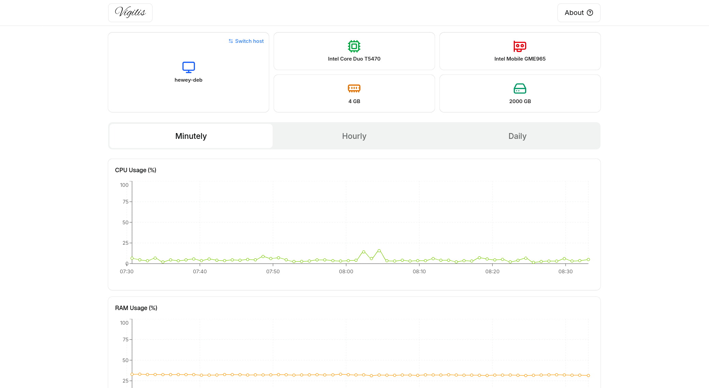

# Vigilis Specula — Monitoring Dashboard

A Next.js dashboard for visualizing server/host metrics (CPU, RAM, Disk, Ping) over time, with interactive charts and host hardware specs pulled from MongoDB.



## Features

- Daily, hourly, and minutely metric views via REST API endpoints
- Interactive line charts (single and multi-series) built with Recharts
- Host specs panel (CPU, GPU, RAM, disk) sourced from MongoDB
- Cache-versioning support so hardware/spec changes invalidate stale client caches
- Rate-limited API routes (`next-rate-limit`)
- Dark/light theming via `next-themes`, UI primitives via Radix/shadcn

## Tech Stack

- [Next.js](https://nextjs.org) 16 (App Router, Turbopack) + React 19
- Tailwind CSS 4
- MongoDB (via the official driver)
- Recharts for charting
- TypeScript

## Project Structure

```
app/
  api/
    charts/{daily,hourly,minutely}/route.ts  # metric endpoints
    hosts/route.ts                           # host spec lookup
  about/                                      # about page
components/
  charts/                                     # chart components (daily/hourly/minutely, single/multi-line)
  sections/                                   # page sections (header, charts, specs)
  ui/                                          # shared UI primitives (shadcn/Radix)
lib/
  mongodb.ts                                  # Mongo client
  utils.ts
```

## Getting Started

### Prerequisites

- Node.js
- A MongoDB instance/connection string

### Setup

1. Install dependencies:
   ```bash
   npm install
   ```
2. Create a `.env.local` file in the project root with:
   ```
   MONGODB_URI="<your MongoDB connection string>"
   NEXT_PUBLIC_CACHE_VERSION=<cache version string>
   ```
3. Run the dev server:
   ```bash
   npm run dev
   ```
4. Open [http://localhost:3000](http://localhost:3000).

### Other scripts

| Command            | Description                     |
| ------------------ | -------------------------------- |
| `npm run build`     | Production build                |
| `npm run start`     | Start production server          |
| `npm run lint`      | Run ESLint                       |
| `npm run format`    | Format code with Prettier        |
| `npm run typecheck` | Type-check without emitting      |

## API

All endpoints accept a `hostname` query param and are rate-limited per client.

- `GET /api/charts/daily?hostname=<name>&limit=<n>` — daily metric aggregates (default host `heweyDeb`, `limit` default 30, max 90)
- `GET /api/charts/hourly?hostname=<name>&limit=<n>` — hourly metric aggregates (default host `heweyDeb`, `limit` default 24, max 72)
- `GET /api/charts/minutely?hostname=<name>&limit=<n>` — minutely metric points for cpu/ram/disk/ping (default host `heweyDeb`, `limit` default 60, max 360)
- `GET /api/hosts?hostname=<name>` — hardware spec for a given host (default host `hewey-deb`)
